VR Force glove
====
This is the repository for a locking vr force glove. This readme will go over how to assemble and run the software needed to make the glove work. To find more information on the design an build process see the post made on my portfolio made [here]()
***

setup and use guide
=======
 parts needed
---
* 3d printer
* arduino nano
* load cell
* hobbyist servo motor
* 1/4 drive hand ratchet
* blue smirf silver Bluetooth module
* potentiometor
* m2 and m5 screws
* linear slide and carriage
* 20 gauge galvanized steel wire or 3in control rod

assembling the glove
---

1. print the stl files located in the stl folder
2. slip the 1/4 drive hand ratchet into the opening of the index_attachment and push the ratchet head into the corresponding opening on the side of the body piece

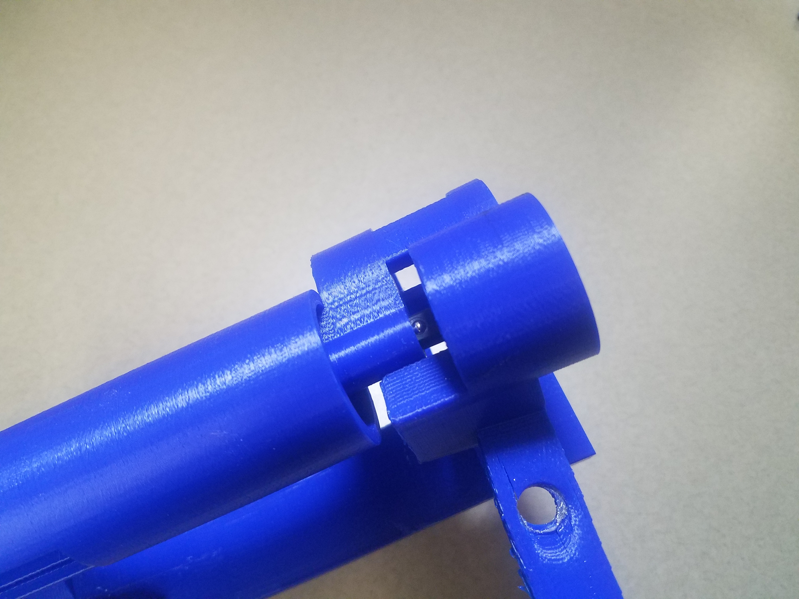
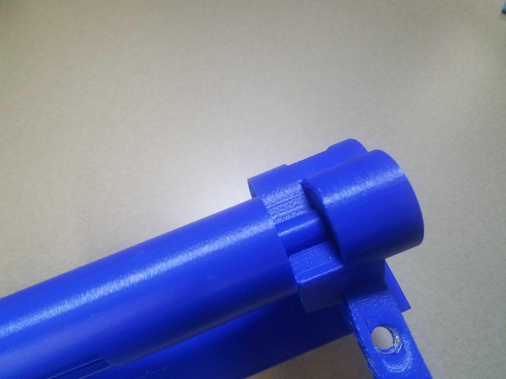

3. place the control_lever over the ratchet head and make sure that the lever is facing upwards and can swing clockwise
  - if the ratchet is in the incorrect orientation return to step 3 and reorient it

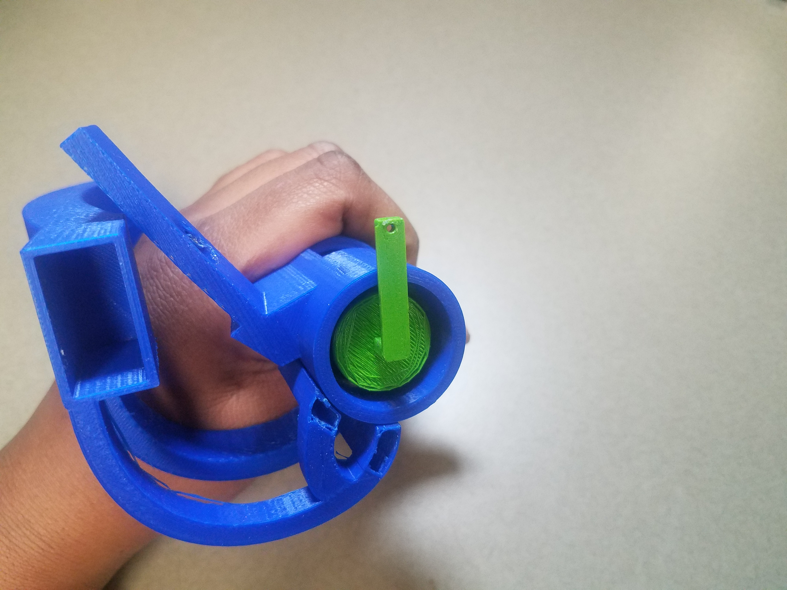
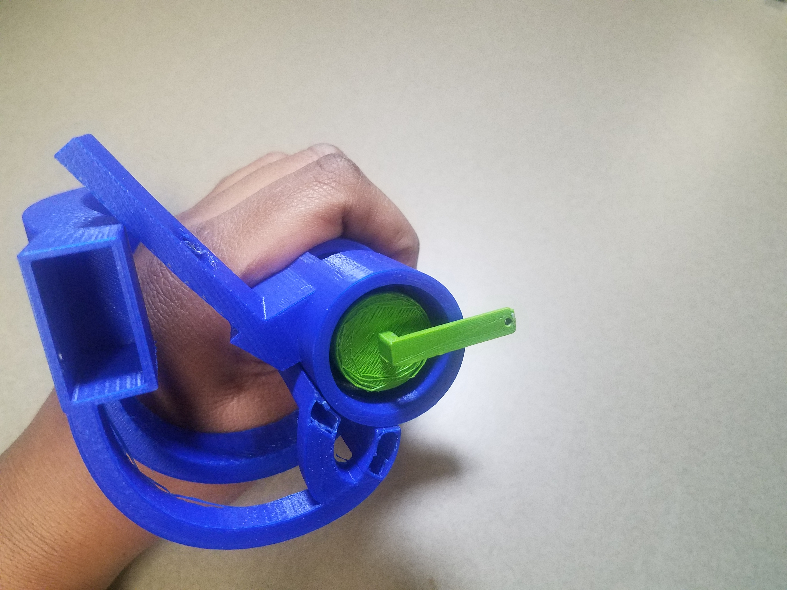

4. put the control_lever through the center hole of the ratchet_cap
5. place the potentiometor into the pot_casing piece and put the knob of the potentiometor into the ratchet_cap piece
6. slide the pot_casing price into its slots on the handle piece as well as sliding the ratchet_cap over the ratchet
7. make sure that the control_lever is able to flick the locking direction of the ratchet when the cap on top
8. place a small piece of glue or tape onto the ratchet_cap to lock it into place on the ratchet_case

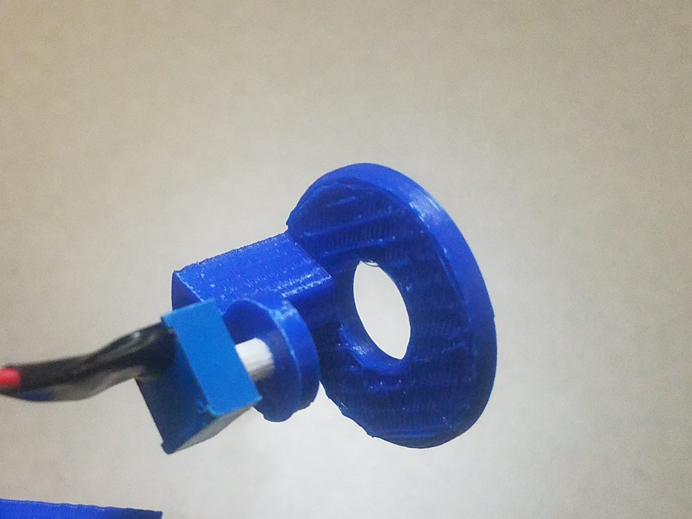
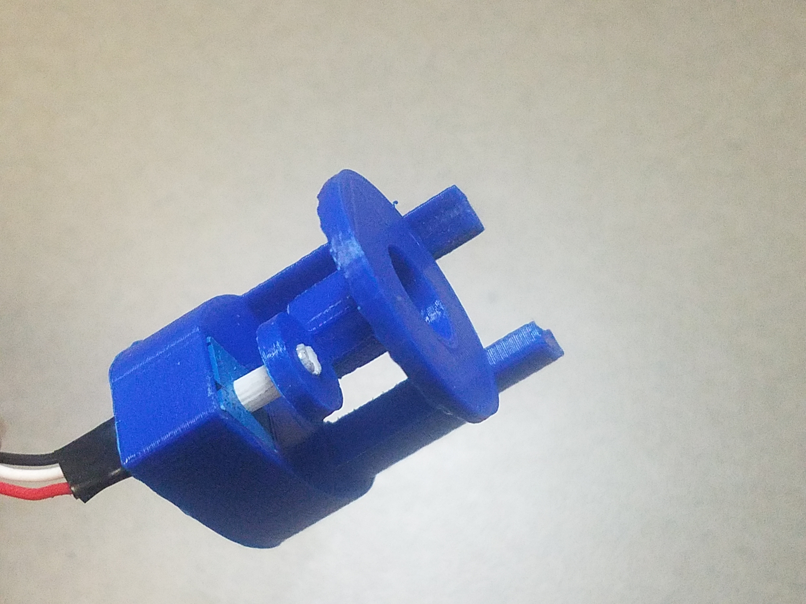
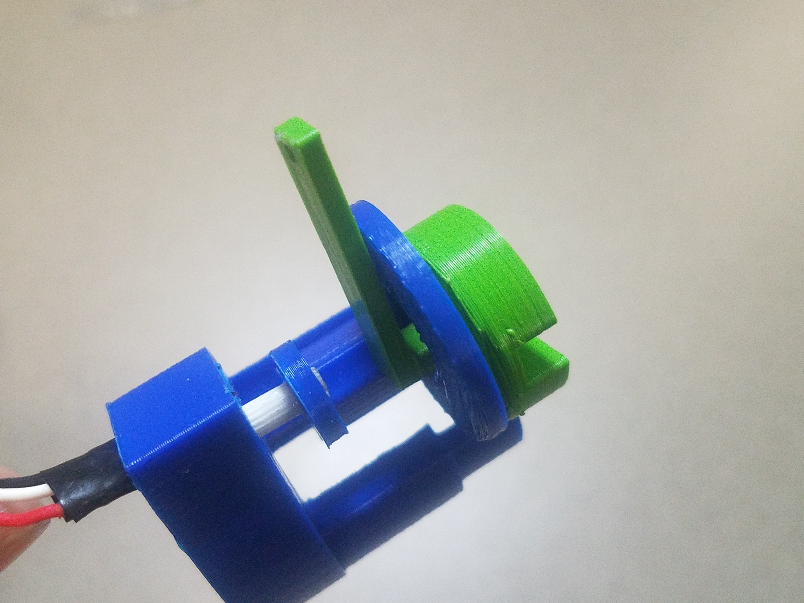

9. create a 3 inch push rod using the steel wire
10. slide the push rod into the hole on the end of the control_lever and the hole on the end of the hobby servo horn.
11. place the hobby servo into its casing at the end of the

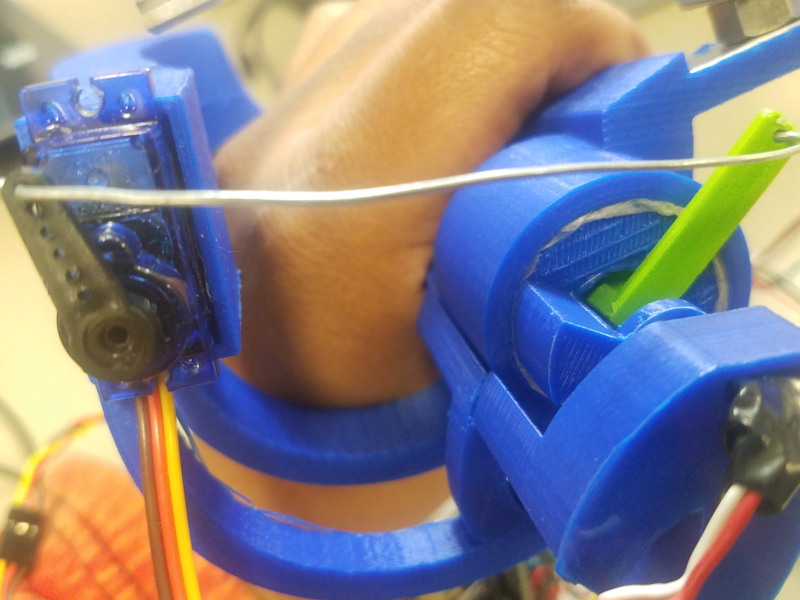

12. slide the bottom half of the strain gauge into the thumb piece as shown. And tighten the bottom bolt.
13. Screw on the rest of the strain gauge

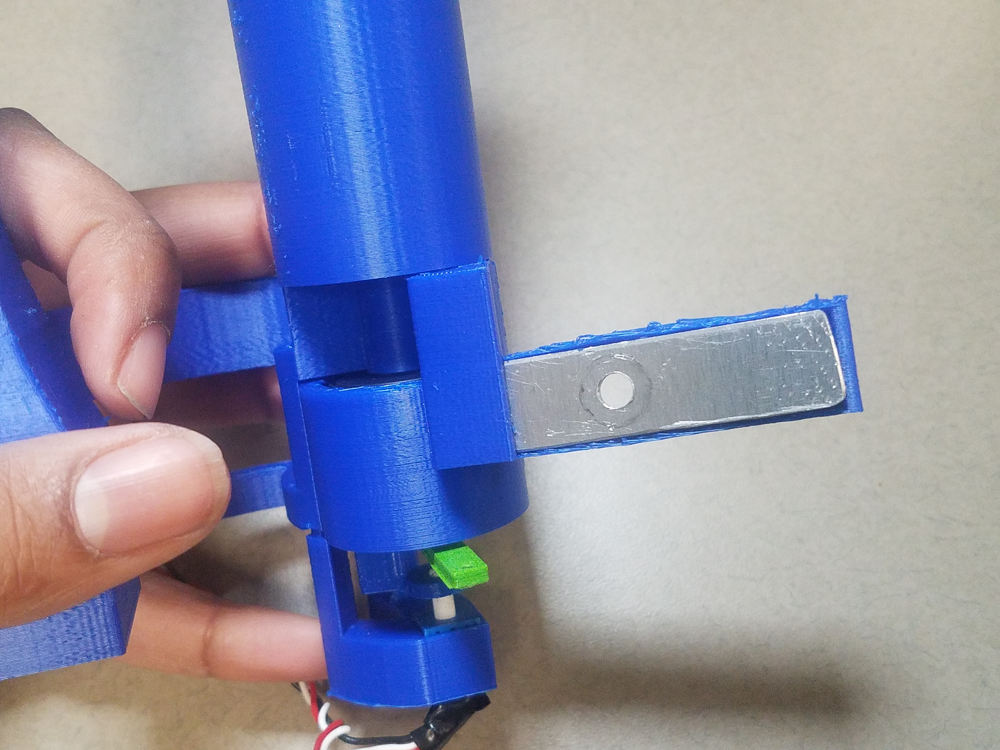
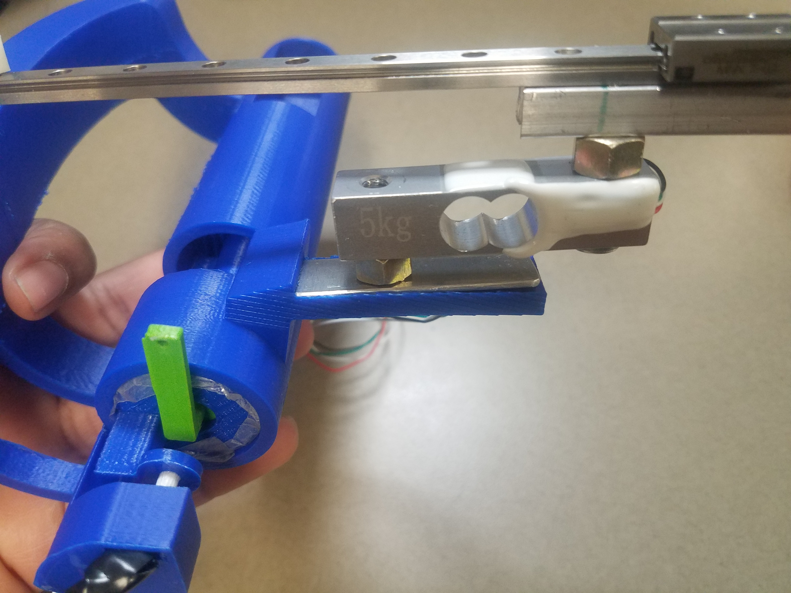

14. place the index_ring_adapter over the linear slide carriage and attach using m2 screws
15. test to make sure the index_ring_adapter and slide are working correctly
  - note: you may have to angle the linear slide slightly to make finger actuation more comfortable
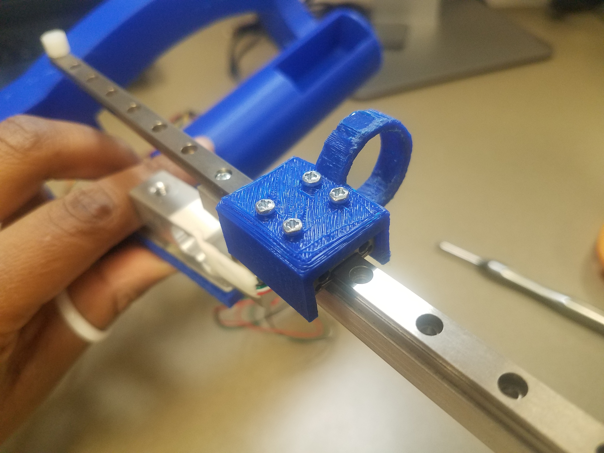

16. screw the puck_mount onto the Vive puck
17. place the puck_mount onto the back of the handle
18. slide the stabilization rods into the holes of the puck_mount.

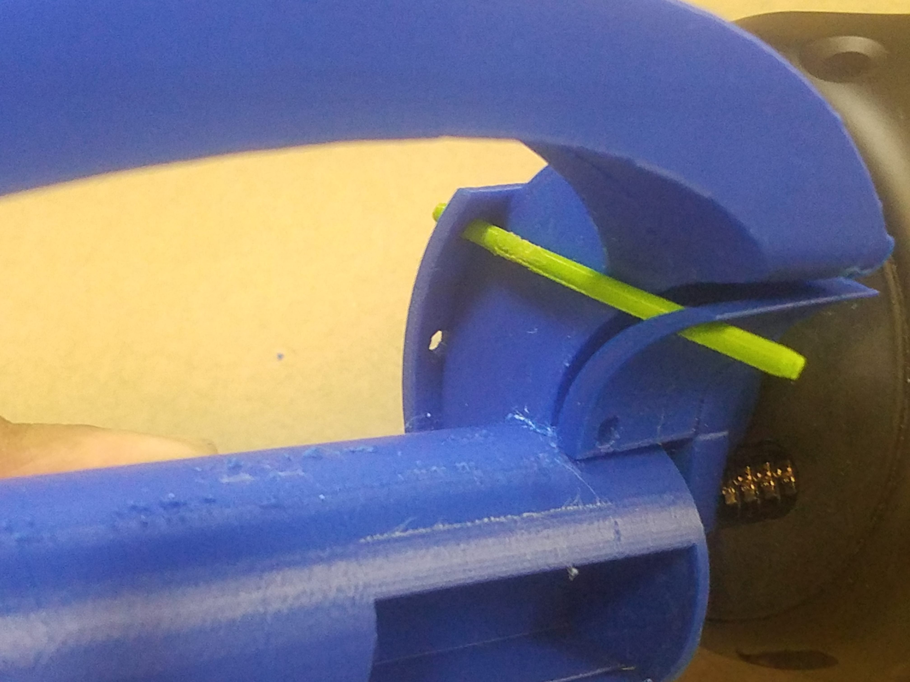

Running the software
---
1. assemble the circuit shown in diagram 1
2. upload the " bluetooth_with_imu" sketch to the Arduino nano and open the serial monitor
3. follow the steps for calibration
  - note: the bottom number should be smaller than the top number. If these values are reversed check your potentiometor
4. pair your blue smirf with your windows computer
5. start Steam VR, and make sure your Vive is properly setup and the vive puck is paired
6. open up the unity project
7. run the python script "virtual_joystick_windows.py"
  - note: in Steam VR a game pad controller icon should appear
8. run the unity project
9. the device should be working now grab something and test it

Package references
---
T. (n.d.). NewtonVR. Retrieved from https://github.com/TomorrowTodayLabs/NewtonVR
B. (n.d.). PYXInput. Retrieved from https://github.com/bayangan1991/PYXInput
M. (n.d.). Pywn32. Retrieved from https://github.com/mhammond/pywin32
V. (n.d.). Steamvr_unity_plugin. Retrieved from https://github.com/ValveSoftware/steamvr_unity_plugin/tree/master/Assets/SteamVR
